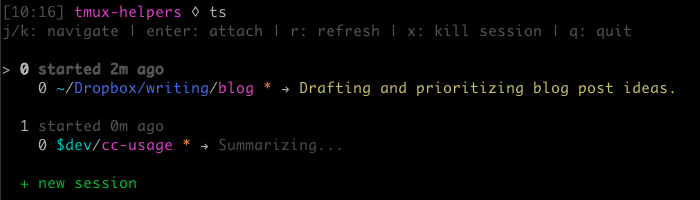

# tmux-helpers

An interactive tmux session manager with a terminal UI. Navigate sessions, see pane working directories, and get AI-generated summaries of what each [Claude Code](https://docs.anthropic.com/en/docs/claude-code) session is working on.



## Features

- Interactive session/pane browser with vim-style navigation
- Attach to specific panes within multi-pane sessions
- AI-powered summaries of Claude Code sessions (via the [`llm`](https://github.com/simonw/llm) CLI)
- Colored path display (with optional [`colorpath`](https://github.com/panozzaj/colorpath) support)
- Create and kill sessions from the UI

## Requirements

- Node.js >= 20
- tmux
- [`llm`](https://github.com/simonw/llm) CLI (optional, for Claude Code session summaries)

## Install

```bash
npm install -g .
```

Or link for development:

```bash
npm link
```

## Usage

```bash
# Launch interactive session picker
tmux-sessions

# Attach directly to a session by name
tmux-sessions <session-name>
```

### Keybindings

| Key | Action |
|---|---|
| `j` / `k` | Navigate up/down |
| `Enter` | Attach to session/pane |
| `r` / `Ctrl+l` | Refresh session list |
| `x` / `d` | Kill session (with confirmation) |
| `q` / `Esc` | Quit |

## How it works

The tool queries tmux for all sessions and panes, then renders an [Ink](https://github.com/vadimdemedes/ink)-based terminal UI. Panes running Claude Code (detected by process name) get an AI-generated summary of their current activity, fetched via the `llm` CLI and cached at `~/.cache/tmux-sessions/`.
